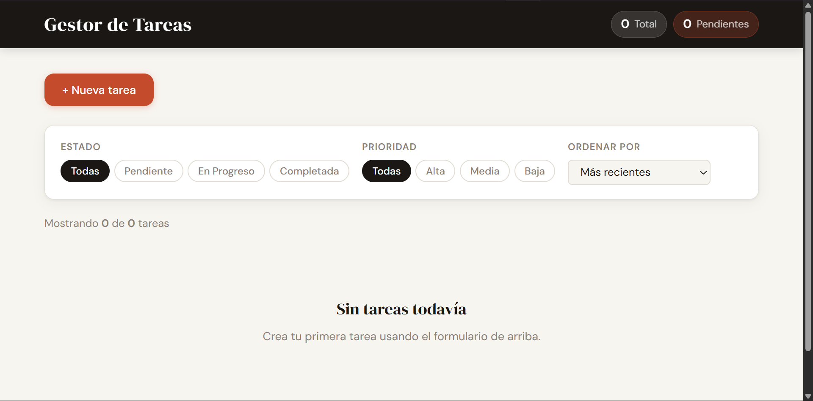

# 📝 Gestor de Tareas

Aplicación web de gestión de tareas desarrollada como proyecto final del curso de desarrollo web con React. Permite crear, visualizar, editar y eliminar tareas, con soporte para filtrado, ordenación y persistencia de datos en el navegador.

🎯 Objetivo

Demostrar los conocimientos adquiridos durante el curso (HTML, CSS, JavaScript y React) mediante la construcción de una aplicación CRUD completa con una interfaz limpia, responsive y funcional.

## Funcionalidades

- Crear tareas con:
    - Título
    - Descripción
    - Prioridad
    - Estado
    - Fecha límite
    - Visualizar tareas en formato lista o grid.
    - Editar tareas desde un formulario pre-rellenado.
    - Eliminar tareas con confirmación previa.
    - Marcar tareas como completadas con cambio visual automático.
- Filtrar tareas por:
    - Estado (Pendiente, En Progreso, Completada)
    - Prioridad (Alta, Media, Baja)
- Ordenar tareas por:
    - Fecha de creación
    - Fecha límite
    - Prioridad
    - Título
    - Persistencia automática mediante localStorage.

Tecnologías utilizadas:

- HTML 🌐
- CSS 🎨
- REACT : ⚛️

🗂️ Estructura del proyecto
src/
├── components/
│   ├── Header.jsx        # Cabecera y título de la app
│   ├── TaskForm.jsx      # Formulario para crear y editar tareas
│   ├── TaskList.jsx      # Contenedor de tareas
│   ├── TaskCard.jsx      # Tarjeta individual de tarea
│   └── FilterBar.jsx     # Controles de filtrado y ordenación
├── App.jsx               # Componente raíz y lógica principal
├── main.jsx              # Punto de entrada
└── index.css             # Estilos globales
- ⚙️ Instalación y puesta en marcha
      Requisitos previos
      Node.js v18 o superior
      npm v9 o superior

## 🚨Comandos necesarios para instalar el proyecto

git clone <url-del-repositorio>

cd gestor_tareas

npm i o npm install

npm run dev

La aplicación estará disponible en:

[http://localhost:5173](http://localhost:5173/)

Diseño Responsive

La aplicación está adaptada para funcionar correctamente en: Portátiles/Móviles/Tablets

📄 Licencia

Este proyecto ha sido desarrollado con fines educativos y de aprendizaje.
